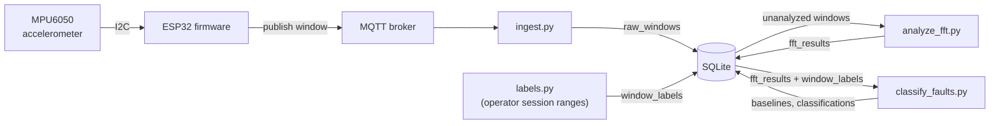
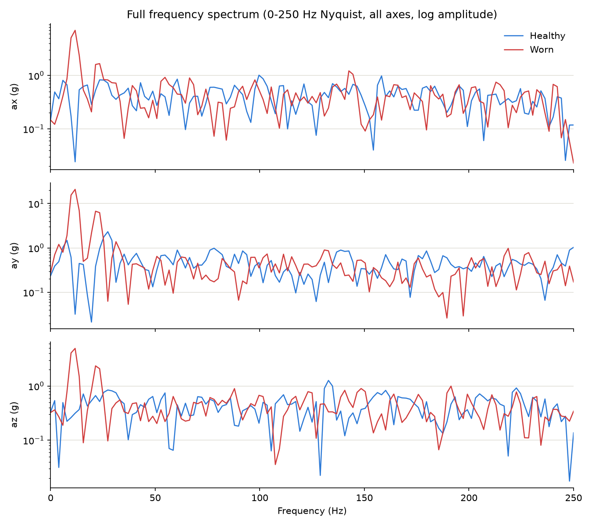

# Conveyor Monitor

Predictive maintenance for an industrial conveyor belt: an ESP32 samples vibration off an MPU6050 accelerometer, streams it over MQTT to a Raspberry Pi, and analyzes this data using FFT to predict belt wear.


## Hardware

**ESP32:** built-in WiFi, well documented and supported with a vendor framework (ESP-IDF), available as both a dev board (used here) and a bare chip for eventual production use, and cheap in bulk.

**MPU6050:** the ESP32 has mature I2C drivers for it and the documentation shows how to use it directly, its sample rate is adequate for the target vibration frequencies, and it's cheap.

**Raspberry Pi 5:** acts as the central device that receives and stores data from every ESP32 on the line. In production deployment this needs to be low-power and physically close to the sensors it's collecting from. A cheaper device could have been used, but the Pi 5 is what I already had.

**Mounting:** the circuit is mounted to the conveyor's metal frame near the motor, attached by magnets and tape.

## Architecture



**Explanation:**

1. The MPU6050 measures vibration along three axes (x, y, z) which is sampled by the ESP32 at an exact 500Hz using a hardware timer (esp_timer). Samples are batched into windows, which are published as JSON to Mosquitto, a MQTT broker.

    - A sample is one accelerometer reading: one instance of `(x, y, z)`. The ESP32 takes one every 2ms (500Hz).

    - A window is a batch of 256 consecutive samples (~0.512 seconds), bundled together and sent as one JSON/MQTT message.

2. A Raspberry Pi hosts the broker locally, and it also reads the vibration data via `ingest.py` which subscribes to the published topic.

3. `ingest.py` validates each window and writes it into a SQLite database in the `raw_windows` table.

4. `analyze_fft.py` is used to analyze the data given enough windows. It performs FFT and writes the results into `fft_results`.

5. `analysis/labels.py` labels each recorded window healthy or worn from operator-recorded session time ranges (the belt is moved between a known-healthy and known-worn setup between recording sessions, so ground truth comes from which session's time range a window falls in). Labels are written to the `window_labels` table and must be populated before classification can run.

6. `classify_faults.py` reads the FFT results and labels, and classifies any new window healthy or worn by comparing the vibration against a baseline from known-healthy windows. Results get saved to the database (`baselines` and `classifications` tables).

7. `analysis/explore_spectra.ipynb` is a Jupyter notebook for checking the data manually.

## Repo layout

```
main/            ESP-IDF firmware: fixed-rate sampling, window buffering, MQTT publish
components/      MPU6050 I2C driver + vendored esp-mqtt / ethernet_init
backend/         ingest.py, analyze_fft.py, storage.py (SQLite schema)
analysis/        labels.py, the classifier, report figures, Notebook
deploy/          Mosquitto config + systemd unit for running the broker and ingest.py as persistent services on the Pi
```

## Analysis results

I ran `backend/analyze_fft.py` on 700 windows split between healthy and worn. These results are then plotted with `analysis/generate_figures.py`.


The worn belt shows an obvious peak at its belt-pass frequency while the motor's own rotation frequency (29.3Hz) barely changes between conditions.



The same comparison across the full 0Hz-to-Nyquist range and all three axes (log amplitude), showing the belt-pass difference isn't an artifact of the 100Hz cutoff or the single axis (`ay`) used above.


| Metric | Healthy (n=350) | Worn (n=350) | Mann-Whitney U |
|---|---|---|---|
| Peak frequency (Hz) | 28.49 ± 4.59 | 8.74 ± 3.98 | U=117736, p=2.10×10⁻¹¹³ |
| Peak amplitude (g) | 2.19 ± 0.62 | 18.97 ± 6.15 | U=1482, p=1.43×10⁻¹¹⁰ |

Mann-Whitney U (a statistical test for data that isn't normally distributed) was used because peak frequency clusters into a handful of discrete FFT bins. The tiny p-values mean the difference between the healthy and worn data is unlikely to be random.

## Fault classification

To see whether any single given window can be classified as healthy or worn, a classifier is used: `analysis/classify_faults.py`. It does this by summing up the FFT amplitude and compares to a baseline.
Every baseline and prediction also gets saved to the `baselines` / `classifications` tables.


| | Predicted healthy | Predicted worn |
|---|---|---|
| **True healthy** | 100 | 6 |
| **True worn** | 17 | 333 |

93.0% accuracy on the 456 held-out windows: 98.5% precision, meaning it catches most but not all of the actually-worn windows. There are some false negatives in identifying healthy windows as worn ones.

## Design decisions

**1. Sampling uses a hardware timer and double buffer:**
The first attempt at sampling was a simple loop with a delay (`vTaskDelay`), but the rate was off, which I confirmed directly with an oscilloscope. This board's FreeRTOS tick only runs at 100Hz, 10ms resolution. This means trying to sample at 500Hz (2ms) is impossible with such a delay, as it will be rounded up to 10ms minimum.

I replaced the delay with `esp_timer`, a hardware timer independent of the FreeRTOS tick. On this timer, the ESP32 reads one sample and stores it at an exact, fixed rate. It runs in a high priority FreeRTOS task, which functions similarly to an interrupt. The publish task can be interrupted by `esp_timer` at any time due to the priority difference.

Additionally, samples are stored by queuing up in two window buffers. While one buffer is being filled with new samples, the other buffer (which already has a full window) is free to be turned into JSON and published on a separate, concurrent task, so a slow network publish never delays the next sample.

I avoided using the vendor's MPU6050 drivers as they add an additional fixed 500Hz to every sample due to reading a configuration register, even though it is defined once at init.

**2. Locally hosted broker:**
My primary WiFi enforces WPA3-only auth, and this ESP32 doesn't reliably use WPA3. Public MQTT brokers are also slow from overload. The solution was to host a broker over my phone's hotspot.

**3. SQLite:**
Given the Pi's limited RAM and CPU and also the simplicity of the data (just a few tables), a lightweight database like SQLite is sufficient.

**4. Windows instead of samples:**
By allowing the ESP32 to collect samples locally into a window first, this guarantees that any single window is a consecutive set of samples. A window in progress can never be truncated or corrupted by network drops, only by hardware issues.

MQTT can be configured via QoS (Quality of Service) to try to guarantee delivery of messages. In the case of a network drop, MQTT will keep retrying delivery, while windows that haven't been read yet will be enqueued into an outbox which can store up to 8 windows, all of which can be read once network is restored.

    - The outbox: a library feature that holds local messages in a queue before they actually deliver over the network.

The window size of 256 samples is specifically chosen for two reasons. First, there is a reasonable amount of time between each window (~0.512 seconds), which means that the 8 window outbox allows for approximately 4.1 seconds of network downtime before windows get dropped, causing data corruption. In practice, this worst case only happens if there is a serious outage in which case testing should be done some other time. Small, infrequent network drops are the main target of this protection time.

    - Size tradeoffs: Increasing the size of the outbox increases the RAM usage. It is a non-issue in this case because testing was done on a dev board, but for a standalone ESP32 chip, the RAM usage of a large outbox is non-trivial considering the size of each window.


## Setup

**Firmware** (ESP-IDF):
```
idf.py set-target esp32
idf.py menuconfig   # set WiFi credentials and the MQTT broker URI (see main/Kconfig.projbuild)
idf.py build flash monitor
```

**Broker** (on the Pi):
```
sudo apt install mosquitto mosquitto-clients
sudo cp deploy/mosquitto/conveyor-monitor.conf /etc/mosquitto/conf.d/
sudo systemctl enable --now mosquitto
```
Listens on LAN: only safe on a private network (see `deploy/mosquitto/conveyor-monitor.conf`).

**Backend** (on the Pi):
```
cd backend
python3 -m venv venv
source venv/bin/activate
pip install -r requirements.txt
python3 ingest.py
python3 analyze_fft.py
```
`analyze_fft.py` processes whatever windows are not analyzed yet, with an optional limit.

**Analysis** (you have known set of healthy/worn data):
```
cd analysis
python3 -m venv venv
source venv/bin/activate
pip install -r requirements.txt
python3 labels.py \
    --healthy-range [datetime_start datetime_end] \
    --worn-range [datetime_start datetime_end]
python3 classify_faults.py
python3 generate_figures.py
```
`labels.py` must run first to classify a set of data as healthy or worn based on their datetime range.


## Current issues

**1. Classification limitations:**
A single window being classified as worn doesn't guarantee the belt is worn. It could've happened by chance or it may be a temporary fault. It is much more useful to see if there is a trend of worn windows which can be used to make more confident statements about belt wear.

Another concern is that belt is unlikely to be the only fault in the conveyor belt. Belt wear was specifically investigated in this project only because it is audibly obvious and is easily fixed after diagnosis. Other faults may have not caused down time so far, but it is a possibility in the future.

**2. No inference:**
Currently the classifier only validates known healthy or worn data. It is unable to do inferences on unknown data.

**3. PCB migration:**
The sensor circuit currently runs on a breadboard with an ESP32 dev board. This was good for prototyping, but installing it along multiple places along the conveyor belt is not cheap nor efficient. A PCB would be ideal to cut power use and make mounting more practical.