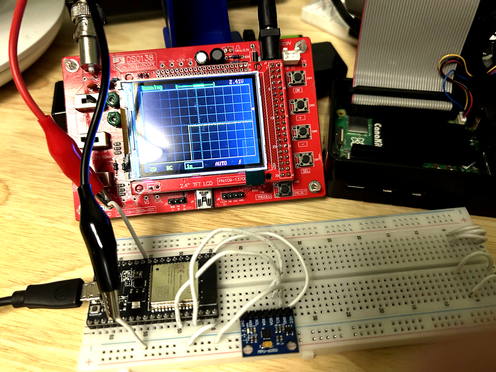
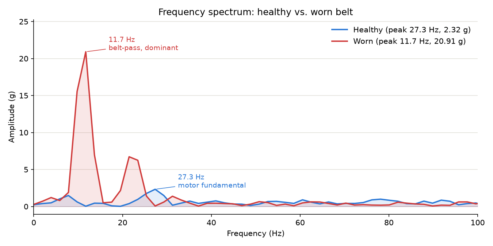
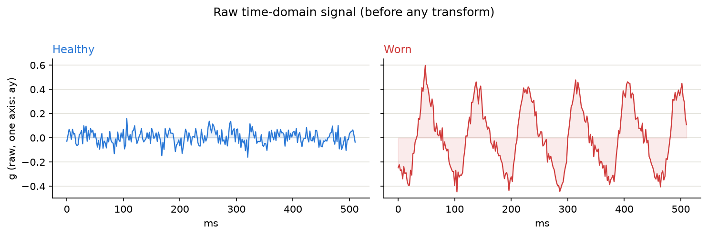
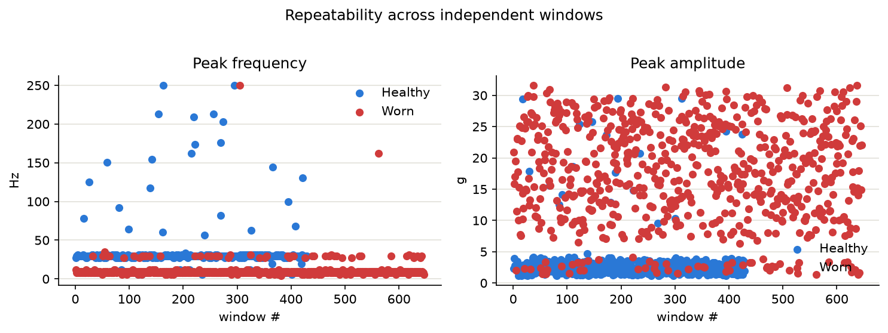
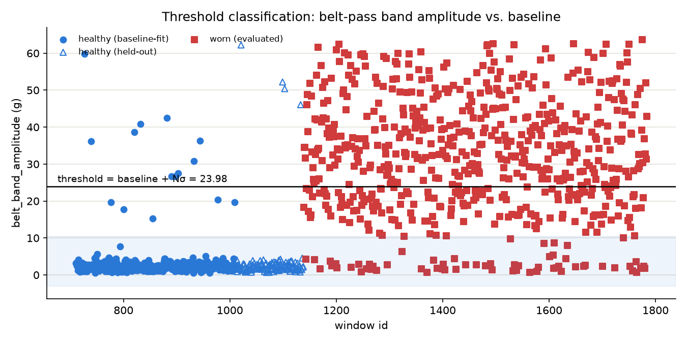

# Conveyor Monitor

Predictive maintenance for an industrial conveyor belt: an ESP32 samples vibration off an MPU6050 accelerometer, streams it over MQTT to a Raspberry Pi, and analyzes this data using FFT to predict belt wear.



## How it works


Explanation

1. The MPU6050 measures vibration along three axes (x, y, z) which is sampled by the ESP32 at an exact 500Hz using a hardware timer (esp_timer). Samples are batched into windows, which are published as JSON to Mosquitto, a MQTT broker.

2. A Raspberry Pi hosts the broker locally, and it also reads the vibration data via `ingest.py` which subscribes to the published topic.

4. `ingest.py` validates each window and writes it into a SQLite database in the `raw_windows` table.

5. `analyze_fft.py` is used to analyze the data given enough windows. It performs FFT and writes the results into `fft_results`.

6. `classify_faults.py` reads the FFT results and classifies any new window healthy or worn by comparing the vibration against a baseline from known-healthy windows. Results get saved to the database (`baselines` and `classifications` tables).

7. `analysis/explore_spectra.ipynb` is a Jupyter notebook for checking the data by hand.

### Sample vs. window

A sample is one accelerometer reading: one instance of `(x, y, z)`. The ESP32 takes one every 2ms (500Hz).

A window is a batch of 256 consecutive samples (~0.512 seconds), bundled together and sent as one JSON/MQTT message.

The backend exclusively uses windows rather than samples: the `raw_windows` table, FFT analysis, and fault classification.

## Repo layout

```
main/            ESP-IDF firmware: fixed-rate sampling, window buffering, MQTT publish
components/      MPU6050 I2C driver + vendored esp-mqtt / ethernet_init
backend/         ingest.py, analyze_fft.py, storage.py (SQLite schema)
analysis/        Report figures, the classifier, Notebook
deploy/          Mosquitto config + systemd units for running the broker and backend as persistent services on the Pi
```

## Analysis results

I ran `backend/analyze_fft.py` on 700 windows split between healthy and worn. These results are then plotted with `analysis/generate_figures.py`.



The worn belt shows an obvious peak at its belt-pass frequency while the motor's own rotation frequency (29.3Hz) barely changes between conditions.





| Metric | Healthy (n=350) | Worn (n=350) | Mann-Whitney U |
|---|---|---|---|
| Peak frequency (Hz) | 28.04 ± 4.35 | 9.01 ± 4.57 | U=116793, p=1.93×10⁻¹¹⁰ |
| Peak amplitude (g) | 3.88 ± 1.13 | 22.17 ± 7.93 | U=6149, p=2.88×10⁻⁹⁴ |

Mann-Whitney U (a statistical test for data that isn't normally distributed) was used because peak frequency clusters into a handful of discrete FFT bins. The tiny p-values mean the difference between the healthy and worn data is unlikely to be random.

## Fault classification

To see whether any single given window can be classified as healthy or worn, a classifier is used: `analysis/classify_faults.py`. It does this by summing up the FFT amplitude and compares to a baseline.
Every baseline and prediction also gets saved to the `baselines` / `classifications` tables.



| | Predicted healthy | Predicted worn |
|---|---|---|
| **True healthy** | 101 | 5 |
| **True worn** | 27 | 323 |

93.0% accuracy on the 456 held-out windows: 98.5% precision, meaning it catches most but not all of the actually-worn windows. There are some false negatives in identifying healthy windows as worn ones.

## Design decisions

**1. Sampling uses a hardware timer and double buffer:**
The first attempt at sampling was a simple loop with a delay (`vTaskDelay`), but the rate was off, which I confirmed directly with an oscilloscope. This board's FreeRTOS tick only runs at 100Hz, 10ms resolution, which rounds a 500Hz sample period down to zero ticks and samples completely uncontrolled.

I replaced the delay with `esp_timer`, a hardware timer independent of the FreeRTOS tick. On this timer, the ESP32 reads one sample and stores it at an exact, fixed rate. 

Additionally, samples are stored by queuing up in two window buffers. While one buffer is being filled with new samples, the other buffer (which already has a full window) is free to be turned into JSON and published on a separate, concurrent task, so a slow network publish never delays the next sample.

**2. MQTT configuration:** 
MQTT can be configured via QoS (Quality of Service) to try to guarantee delivery of messages: The back end subscribes at QoS 1, meaning it retries until acknowledged. This makes the broker hold onto published messages if the Pi or ESP32 go offline instead of dropping them.


**3. Locally hosted broker:** My primary WiFi enforces
WPA3-only auth, and this ESP32 doesn't reliably use WPA3. Public MQTT brokers are also slow from overload. The solution was to host a broker over my phone's hotspot.

**4. SQLite:**

Given the Pi's limited RAM and CPU and also the simplicity of the data (just a few tables), a lightweight database like SQLite is sufficient.

## Current issues

**1. Classification:**
A single window being classified as worn doesn't guarantee the belt is worn. It could've happened by chance or it may be a temporary fault. It is much more useful to see if there is a trend of worn windows which can be used to make more confident statements about belt wear. 

**2. PCB migration:**
The sensor circuit currently runs on a breadboard with an ESP32 dev board. This was good for prototyping, but installing it along multiple places along the conveyor belt is not cheap nor efficient. A PCB would be ideal to cut power use and make mounting more practical.
