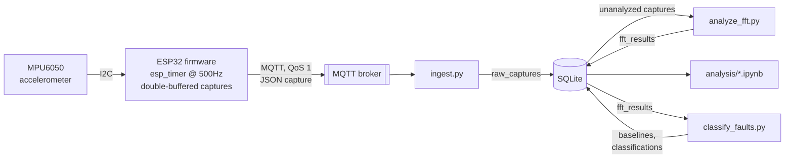

# Conveyor Monitor

This is my project to detect conveyor belt faults before they cause down
time, instead of waiting on a fixed maintenance schedule or an actual
breakdown (that's what "predictive maintenance" in the title means). I
strapped an accelerometer to the conveyor and found that a worn belt
vibrates differently than a healthy one. Capture that vibration and look
at it the right way, and you can tell the two apart automatically.

The pipeline: an ESP32 microcontroller reads vibration off an MPU6050
accelerometer, sends it wirelessly to a Raspberry Pi, and the Pi crunches
the numbers (using an FFT, explained below) to decide healthy or worn.
The rest of this README covers how that works, what I found testing it
on a real belt, and a few design choices that weren't obvious to me at
first.


## How it works



Reading left to right:

1. The MPU6050 measures vibration along three axes (x, y, z) and talks to
   the ESP32 over I2C, a simple two-wire protocol most sensor chips use
   to talk to a microcontroller. I'm not covering the MPU6050 setup here
   since I already know that part cold. This README picks up right after
   it.

2. The ESP32 (a small WiFi-capable microcontroller, popular in hobby
   electronics because it's cheap and has WiFi built in) samples the
   accelerometer at a fixed rate (500 times per second by default) using
   a hardware timer rather than a plain software delay loop (see
   [Design decisions](#design-decisions) for why that matters). It
   batches samples into a "capture," packages the batch as JSON
   (plain-text, human-readable data format), and sends it out.

3. Each capture goes out over WiFi using MQTT, a lightweight messaging
   protocol built for small, low-power, unreliable-network devices. In
   MQTT, nobody talks directly to anybody else: a "publisher" (my ESP32)
   sends messages to a named channel called a "topic," and a
   "subscriber" (my Pi) listens on that topic, with both sides only ever
   connected to a middleman server called a "broker." Here the broker is
   Mosquitto, a small program running on the Pi.

4. `ingest.py`, a Python script on the Pi, subscribes to the ESP32's
   topic, sanity-checks each incoming capture, and writes it into a
   SQLite database (just a single file on disk, no separate database
   server to install or run) as a row in the `raw_captures` table.

5. `analyze_fft.py` is a separate script. It checks the database
   periodically for captures nobody's analyzed yet, runs an FFT (Fast
   Fourier Transform) on each one, and writes the result into
   `fft_results`. An FFT takes a signal that wiggles over time and
   re-expresses it in terms of frequency, like picking the individual
   notes out of a chord. That matters here because belt wear shows up as
   extra vibration at a specific, predictable frequency (how fast a
   specific mechanical part on the belt cycles), which is much easier to
   spot in frequency space than in the raw wiggly signal.

6. `classify_faults.py` reads the FFT results and calls a capture
   healthy or worn, by comparing vibration strength near that belt-wear
   frequency against a baseline learned from known-healthy captures.
   Results get saved to the database too (`baselines` and
   `classifications` tables), not just printed.

7. `analysis/explore_spectra.ipynb` is a Jupyter notebook for exploring
   the data by hand instead of only trusting the scripts' verdicts.

One thing I did on purpose: `ingest.py` and `analyze_fft.py` never talk to
each other directly. No shared MQTT topic, no queue between them, just
the database file. That means either one can crash, get restarted, or
fall behind without taking the other down with it. More on why that
mattered in [Design decisions](#design-decisions).

## Repo layout

```
main/            ESP-IDF firmware: fixed-rate sampling, capture buffering, MQTT publish
components/      MPU6050 I2C driver + vendored esp-mqtt / ethernet_init
backend/         ingest.py, analyze_fft.py, storage.py (SQLite schema)
analysis/        Notebook, static report figures, and the threshold classifier
deploy/          Mosquitto config + systemd units for running the broker and
                 backend as boot-persistent services on the Pi
```

(ESP-IDF is Espressif's official toolchain for building and flashing code
onto ESP32 chips. If you've used Arduino for ESP32 before, ESP-IDF is the
lower-level, more "official" alternative it's built on top of. `deploy/`
holds the Mosquitto broker config and systemd units, systemd being
Linux's built-in service manager, that keep the broker and backend
running unattended on the Pi.)

## Analysis results

This is where the FFT idea from [How it works](#how-it-works) pays off.
I ran `backend/analyze_fft.py` on 700 captures (350 while the belt was
healthy, 350 after it had visibly worn) and plotted the result with
`analysis/generate_figures.py`. Both conditions came from the same
physical device, just split by when they were captured rather than
using a separate device for each condition (see `analysis/labels.py`).


The worn belt shows a clear peak at its belt-pass frequency (the
frequency tied to how often a specific part on the belt cycles past a
fixed point), while the motor's own rotation frequency (29.3 Hz) barely
moves between conditions. That's a good sign the effect is about belt
wear and not just "the motor sounds different now." The same story is
there in the raw signal, before any FFT, though it's much less obvious
to the eye:


And it holds up across all 350 independent captures per condition, not
just the one pair of examples I happened to pick for the plots above:


| Metric | Healthy (n=350) | Worn (n=350) | Mann-Whitney U |
|---|---|---|---|
| Peak frequency (Hz) | 28.49 ± 4.59 | 8.74 ± 3.98 | U=117736, p=2.10×10⁻¹¹³ |
| Peak amplitude (g) | 2.19 ± 0.62 | 18.97 ± 6.15 | U=1482, p=1.43×10⁻¹¹⁰ |

I had to look up "Mann-Whitney U" myself: it's a statistical test for
whether two groups of numbers are actually different or just randomly
noisy, similar in spirit to a t-test, which is the more commonly known
version. I used Mann-Whitney instead of a t-test because peak frequency
clusters into a handful of discrete FFT bins rather than varying
smoothly, which breaks an assumption a t-test needs (that the data looks
roughly bell-curve shaped). Mann-Whitney doesn't need that assumption,
so it's the valid choice for both rows here. The tiny p-values mean
there's almost no chance this separation between healthy and worn is a
coincidence.

It's not a perfect split though. A few captures on each side land closer
to the other condition than to their own (an early-wear capture that
barely registers, or a healthy capture with a random noise burst). The
separation is still overwhelming, just not so clean it'd make me want to
double check for a bug.

## Fault classification

The analysis above tells me healthy and worn look different, but it
doesn't make a call on any single capture. That's what
`analysis/classify_faults.py` does: my first real attempt at automatically
labeling a capture healthy or worn, not just visualizing its spectrum.

I kept it deliberately simple, nowhere near a trained model or proper
anomaly detection yet. It sums the FFT amplitude in a band around the
belt-pass frequency and compares that single number to a baseline (mean
+ 3 standard deviations, a common "how far from normal is too far" rule
of thumb) fit on 70% of the healthy captures (244 of 350). The other 106
healthy captures, plus all 350 worn ones, are held out purely for
evaluation. The classifier never sees them while its threshold is being
set, so the results below reflect how it'd do on new data. Every
baseline and prediction gets saved to the `baselines` / `classifications`
tables, not just printed to the console.


| | Predicted healthy | Predicted worn |
|---|---|---|
| **True healthy** | 100 | 6 |
| **True worn** | 17 | 333 |

95.0% accuracy on the 456 held-out captures: 98.2% precision, meaning
when it says worn it's almost always right, and 95.1% recall, meaning it
catches most but not all of the actually-worn captures. It throws a
handful of false alarms on healthy captures, and misses about 5% of worn
ones, mostly early-stage wear that hadn't pushed the belt-pass amplitude
far enough above baseline yet. That's a reasonable failure mode for
something this simple, and I want to be upfront about it: this is one
belt, one capture session, so it doesn't yet tell me the threshold holds
under a different load, speed, or belt, or that wear always shows up
through this exact feature. Testing it across more sessions, different
loads, speeds, belts, is what would turn this from "a reasonable first
attempt" into something I'd trust unsupervised. Anomaly detection or a
trained model are only worth reaching for after that, and only if the
threshold turns out too brittle in practice.

## Design decisions

**Sampling is timer-driven, not delay-driven, and double-buffered.** My
first attempt at sampling was a simple loop with a delay in it
(`vTaskDelay`), but the rate was off, which I confirmed directly with an
oscilloscope. This board's FreeRTOS tick (FreeRTOS is the real-time
operating system ESP-IDF runs on top of) only runs at 100Hz, 10ms
resolution, which rounds a 500Hz/2ms sample period down to zero ticks
and samples completely uncontrolled. So instead the firmware uses
`esp_timer`, a hardware timer independent of that tick, to fire a
minimal "read one sample, store it" callback at an exact, fixed rate. It
alternates between two capture buffers, so while one buffer is being
filled with new samples, the other (already-full) buffer is free to be
turned into JSON and published on a separate task, so a slow network
publish never delays the next sample.

**Ingestion and analysis run as separate programs.** `ingest.py` does
exactly one job: validate an incoming capture and write it to SQLite.
`analyze_fft.py` has no MQTT client at all. It's a standalone script
that polls the database for captures with no result yet, computes the
spectrum, and writes it back. A failure in one never blocks the other,
and re-running analysis is safe because it just skips captures it's
already handled, so I don't have to remember to be careful about it.

**SQLite over something like Postgres.** Only one process writes at a
time, one row per capture, so there's no need for a full database server
competing with the MQTT broker for a Raspberry Pi's limited RAM and CPU.
I turned on WAL mode (write-ahead logging, a SQLite setting that lets
other programs read the file while something is actively writing to it,
instead of locking everyone else out), so I can open a notebook and poke
at the data while `ingest.py` is still appending to it live. Two tables,
`raw_captures` and `fft_results`, linked by `capture_id`, keep raw data
and derived spectra separate so neither ever overwrites the other.

**QoS and session settings are matched end to end.** MQTT's "QoS"
(Quality of Service) setting controls how hard it tries to guarantee
delivery: QoS 0 is fire-and-forget, QoS 1 means it retries until
acknowledged. The catch is that the effective guarantee is whichever
side is weaker, `min(publish QoS, subscribe QoS)`, so publishing at QoS 1
buys nothing if the subscriber only listens at QoS 0. Nothing errors
when the two are mismatched, which makes it an easy trap to fall into.
My ingestion client subscribes at QoS 1 with a stable `client_id` and
`clean_session=False` (these two together tell the broker this is the
same client reconnecting, hold onto anything it missed, rather than
treating every connection as a stranger), so the broker holds onto
messages published while it was offline instead of dropping them.

**The classifier is a threshold, not a trained model, on purpose.** All
my data so far comes from one conveyor and one capture session. That's
not enough to trust a black-box model not to secretly overfit to this
specific belt, load, and speed, and a trained model's weights don't
announce when that's happened. A threshold on one physically meaningful
number stays inspectable, I can look at it and reason about it, and
recalibrating it as I capture more sessions is just changing a number,
not retraining anything.

**The network is a phone hotspot, on purpose.** My main WiFi enforces
WPA3-only auth, and this particular board (an original ESP32) doesn't
reliably negotiate WPA3. I also hit connection failures early on against
a public MQTT broker over that hotspot. It turned out to be the
carrier's traffic shaping dropping plain, non-standard-port TCP traffic,
nothing wrong with the broker itself. Running the broker locally on the
same hotspot (see `deploy/`) keeps all this traffic off the carrier's
network entirely, sidestepping both problems without me having to touch
router settings I don't control anyway.

**A network drop queues the capture instead of dropping it.** QoS 1 only
guarantees delivery of messages the client tries to send. It doesn't
help if the firmware just refuses to publish at all while disconnected,
which is what mine used to do. Now `esp_mqtt_client_publish` gets called
unconditionally, and the MQTT client's own outbox (a queue capped at 8
captures' worth of JSON, so a stuck connection can't grow it forever on
a memory-constrained chip) holds anything sent while offline and
flushes it once auto-reconnect (2s retry, down from the 10s default)
brings the link back. A hotspot blip now costs a delay, not silently
lost data. Only an outage longer than the outbox can hold still drops
captures, and when that happens it's logged loudly, not silent.

## Future improvements

**PCB migration.** The sensor circuit currently runs on a breadboard
with an ESP32 dev board. That's made prototyping easy, but mounting it
in multiple locations along the conveyor calls for something sturdier.
A custom PCB would be cheap and practical for that.
