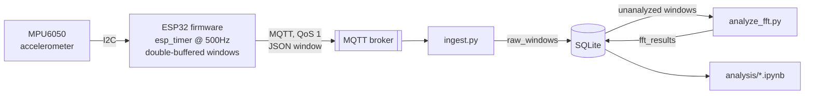

# Conveyor Monitor

Predictive maintenance for an industrial conveyor belt: an ESP32 samples vibration
off an MPU6050 accelerometer, streams it over MQTT to a
Raspberry Pi, and a decoupled batch job turns each window into a frequency
spectrum via FFT. The eventual goal is catching belt wear from how the
vibration signature drifts over time, before it causes downtime — this repo
covers the sensing → transport → storage → spectrum pipeline; baseline
capture and fault classification are the next phase (see [Status](#status)).

## Architecture



Ingestion and analysis are deliberately two separate processes talking only
through the database, not through MQTT or a shared queue — see
[Design decisions](#design-decisions).

## Repo layout

```
main/            ESP-IDF firmware: fixed-rate sampling, windowing, MQTT publish
components/      MPU6050 I2C driver + vendored esp-mqtt / ethernet_init
backend/         ingest.py, analyze_fft.py, storage.py (SQLite schema)
analysis/        Jupyter notebook for exploratory spectrum plotting
TODO.md          Working engineering log: open items, decisions, rationale
```

## Design decisions

A few choices here aren't the first thing you'd reach for, so it's worth
saying why.

**Sampling is timer-driven, not delay-driven, and double-buffered.**
A naive `vTaskDelay`-based sample loop looks fine until you check the
numbers: this board's FreeRTOS tick is 100Hz (10ms resolution), which would
round a 500Hz/2ms sample period down to zero ticks and sample uncontrolled.
Firmware instead uses `esp_timer` — backed by hardware, independent of the
FreeRTOS tick — to fire a minimal read-and-store callback at a fixed rate,
alternating between two window buffers. The slower part (JSON serialization,
network publish) runs in a separate task, so a stalled MQTT publish never
delays the next sample.

**Ingestion and analysis are separate processes, not one pipeline.**
`ingest.py` does exactly one thing: validate an incoming window and write it
to SQLite. `analyze_fft.py` is a standalone script with no MQTT client at
all — it polls the database for windows without a matching result, computes
the spectrum, and writes it back. Failure in one never blocks the other, and
re-running analysis is safe by construction (it skips windows already
analyzed) rather than by convention.

**SQLite, not Postgres.** Single writer at a time, one row per window, no
daemon competing with the MQTT broker for a Raspberry Pi's resources.
WAL mode is enabled so notebooks can read the file while a writer is still
appending. Two tables — `raw_windows` and `fft_results`, linked by
`window_id` — so raw data and derived spectra are kept separately and
neither is ever overwritten by the other.

**QoS and session state are matched end-to-end, not just set once.**
MQTT's effective delivery guarantee is `min(publish QoS, subscribe QoS)`, so
publishing at QoS 1 does nothing if the subscriber listens at QoS 0 — an
easy mismatch to introduce without noticing, since nothing errors. The
ingestion client subscribes at QoS 1 with a stable `client_id` and
`clean_session=False`, so the broker holds messages published while it's
offline instead of silently dropping them.

**The network is a phone hotspot, on purpose.** The primary WiFi network
here enforces WPA3-only auth, which this board's (original ESP32) software WPA3
implementation doesn't reliably negotiate. Early testing also hit
connection failures against a public MQTT broker over that hotspot — turned
out to be the carrier's traffic shaping dropping plain, non-standard-port
TCP, not the broker. Running the broker locally on the same hotspot network
keeps traffic from ever crossing onto the carrier's WAN, sidestepping both
problems without touching the router config.

## Status

| Component | State |
|---|---|
| Firmware: fixed-rate windowed sampling, JSON publish | Implemented, code-reviewed; not yet run on physical hardware (no toolchain in the dev environment used to write it) |
| MQTT transport: topics, QoS, persistent session | Implemented |
| Ingestion (`ingest.py`) | Implemented, tested against synthetic MQTT payloads |
| FFT analysis (`analyze_fft.py`) | Implemented, verified end-to-end against synthetic multi-window data, including idempotency on re-run |
| Local broker deployment | Not yet done — currently pointed at a public cloud broker as an interim step |
| Spectrum exploration notebook | Implemented, executes cleanly against the real schema |
| Baseline capture, feature extraction, fault detection | Not started — intentionally deferred until there's real sensor data to develop it against |

## Getting started

**Firmware** — configure via `idf.py menuconfig` (WiFi credentials, MQTT
broker URI, MPU6050 I2C pins, `CONFIG_SAMPLE_RATE_HZ` /
`CONFIG_SAMPLE_WINDOW_SIZE`), then `idf.py build flash monitor`.

**Backend**, on the Pi or wherever the broker runs:

```
pip install -r backend/requirements.txt
MQTT_BROKER_HOST=<broker-host> python3 backend/ingest.py       # long-running
python3 backend/analyze_fft.py --watch 30                      # or run once without --watch
```

**Analysis** — `pip install -r analysis/requirements.txt`, open
`analysis/explore_spectra.ipynb`.

## Roadmap

Tracked in detail in [`TODO.md`](TODO.md); the near-term path is: stand up
the local broker → validate the firmware on real hardware → run a capture
session to pick a sample rate against the conveyor's actual mechanical
frequencies (currently a 500Hz placeholder) → capture a known-healthy
baseline spectrum → build feature extraction and drift detection against
real data, in that order.
