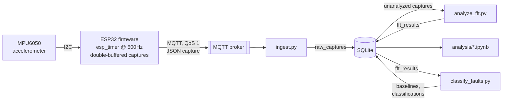

# Conveyor Monitor

Predictive maintenance for an industrial conveyor belt: an ESP32 samples vibration off an MPU6050 accelerometer, streams it over MQTT to a Raspberry Pi, and analyzes this data using FFT to predict belt wear.


## How it works



Explanation

1. The MPU6050 measures vibration along three axes (x, y, z) which is sampled by the ESP32 at an exact 500Hz using a hardware timer (esp_timer). These samples are published as JSON to Mosquitto, a MQTT broker.

2. A Raspberry Pi hosts the broker locally, and it also reads the vibration data via `ingest.py` which subscribes to the published topic.

4. `ingest.py` validates each capture and writes it into a SQLite database in the `raw_captures` table.

5. `analyze_fft.py` is used to analyze the data given enough captures. It performs FFT and writes the results into `fft_results`.

6. `classify_faults.py` reads the FFT results and classifies any new capture healthy or worn by comparing the vibration against a baseline from known-healthy captures. Results get saved to the database (`baselines` and `classifications` tables).

7. `analysis/explore_spectra.ipynb` is a Jupyter notebook for checking the data by hand.

## Repo layout

```
main/            ESP-IDF firmware: fixed-rate sampling, capture buffering, MQTT publish
components/      MPU6050 I2C driver + vendored esp-mqtt / ethernet_init
backend/         ingest.py, analyze_fft.py, storage.py (SQLite schema)
analysis/        Report figures, the classifier, Notebook
deploy/          Mosquitto config + systemd units for running the broker and backend as persistent services on the Pi
```

## Analysis results

I ran `backend/analyze_fft.py` on 700 captures split between healthy and worn. These results are then plotted with `analysis/generate_figures.py`.


The worn belt shows an obvious peak at its belt-pass frequency while the motor's own rotation frequency (29.3Hz) barely changes between conditions.


| Metric | Healthy (n=350) | Worn (n=350) | Mann-Whitney U |
|---|---|---|---|
| Peak frequency (Hz) | 28.04 ± 4.35 | 9.01 ± 4.57 | U=116793, p=1.93×10⁻¹¹⁰ |
| Peak amplitude (g) | 3.88 ± 1.13 | 22.17 ± 7.93 | U=6149, p=2.88×10⁻⁹⁴ |

Mann-Whitney U (a statistical test for data that isn't normally distributed) was used because peak frequency clusters into a handful of discrete FFT bins. The tiny p-values mean the difference between the healthy and worn data is unlikely to be random.

## Fault classification

To see whether any single given capture can be classified as healthy or worn, a classifier is used: `analysis/classify_faults.py`. It does this by summing up the FFT amplitude and compares to a baseline.
Every baseline and prediction also gets saved to the `baselines` / `classifications` tables.


| | Predicted healthy | Predicted worn |
|---|---|---|
| **True healthy** | 101 | 5 |
| **True worn** | 27 | 323 |

93.0% accuracy on the 456 held-out captures: 98.5% precision, meaning it catches most but not all of the actually-worn captures. There are some false negatives in identifying healthy captures as worn ones.

## Design decisions

**Sampling uses a hardware timer and double buffer**
The first attempt at sampling was a simple loop with a delay (`vTaskDelay`), but the rate was off, which I confirmed directly with an oscilloscope. This board's FreeRTOS tick only runs at 100Hz, 10ms resolution, which rounds a 500Hz sample period down to zero ticks and samples completely uncontrolled.

I replaced the delay with `esp_timer`, a hardware timer independent of the FreeRTOS tick. On this timer, the ESP32 reads one sample and stores it at an exact, fixed rate. 

Additionally, samples are stored by queuing up in two capture buffers. While one buffer is being filled with new samples, the other buffer (which already has a sample) is free to be turned into JSON and published on a separate, concurrent task, so a slow network publish never delays the next sample.

**SQLite** Only one process writes at a
time, one row per capture, so there's no need for a full database server
competing with the MQTT broker for a Raspberry Pi's limited RAM and CPU.
I turned on WAL mode (write-ahead logging, a SQLite setting that lets
other programs read the file while something is actively writing to it,
instead of locking everyone else out), so I can open a notebook and poke
at the data while `ingest.py` is still appending to it live. Two tables,
`raw_captures` and `fft_results`, linked by `capture_id`, keep raw data
and derived spectra separate so neither ever overwrites the other.

**QoS and session settings** MQTT's "QoS"
(Quality of Service) setting controls how hard it tries to guarantee
delivery: QoS 0 is fire-and-forget, QoS 1 means it retries until
acknowledged. The catch is that the effective guarantee is whichever
side is weaker, `min(publish QoS, subscribe QoS)`, so publishing at QoS 1
buys nothing if the subscriber only listens at QoS 0. Nothing errors
when the two are mismatched, which makes it an easy trap to fall into.
My ingestion client subscribes at QoS 1 with a stable `client_id` and
`clean_session=False` (these two together tell the broker this is the
same client reconnecting, hold onto anything it missed, rather than
treating every connection as a stranger), so the broker holds onto
messages published while it was offline instead of dropping them.

**The classifier is a threshold** All
my data so far comes from one conveyor and one capture session. That's
not enough to trust a black-box model not to secretly overfit to this
specific belt, load, and speed, and a trained model's weights don't
announce when that's happened. A threshold on one physically meaningful
number stays inspectable, I can look at it and reason about it, and
recalibrating it as I capture more sessions is just changing a number,
not retraining anything.

**The network is a phone hotspot** My main WiFi enforces
WPA3-only auth, and this particular board (an original ESP32) doesn't
reliably negotiate WPA3. I also hit connection failures early on against
a public MQTT broker over that hotspot. It turned out to be the
carrier's traffic shaping dropping plain, non-standard-port TCP traffic,
nothing wrong with the broker itself. Running the broker locally on the
same hotspot (see `deploy/`) keeps all this traffic off the carrier's
network entirely, sidestepping both problems without me having to touch
router settings I don't control anyway.

**A network drop queues the capture instead of dropping it** QoS 1 only
guarantees delivery of messages the client tries to send. It doesn't
help if the firmware just refuses to publish at all while disconnected,
which is what mine used to do. Now `esp_mqtt_client_publish` gets called
unconditionally, and the MQTT client's own outbox (a queue capped at 8
captures' worth of JSON, so a stuck connection can't grow it forever on
a memory-constrained chip) holds anything sent while offline and
flushes it once auto-reconnect (2s retry, down from the 10s default)
brings the link back. A hotspot blip now costs a delay, not silently
lost data. Only an outage longer than the outbox can hold still drops
captures, and when that happens it's logged loudly, not silent.

## Current issuees
**Single capture classification.** A single capture being classified as worn doesn't guarantee the belt is worn. It could've happened by chance or it may be a temporary fault. It is much more useful to see if there is a trend of worn captures which can be used to make more confident statements about belt wear. 

**PCB migration.** The sensor circuit currently runs on a breadboard with an ESP32 dev board. This was good for prototyping, but installing it along multiple places along the conveyor belt is not cheap nor efficient. A PCB would be ideal to cut power use and make mounting more practical.
